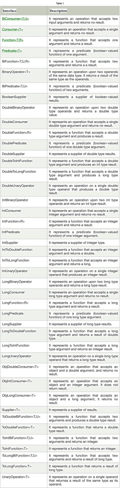

# Java 8 Features

### Java Lambda Expressions
A lambda expression is a short block of code which takes in parameters and returns a value. 
Lambda expressions are similar to methods, but they do not need a name and they can be implemented right in the body of a method.

**Syntax:**

The simplest lambda expression contains a single parameter and an expression:

`parameter -> expression`

To use more than one parameter, wrap them in parentheses:

`(parameter1, parameter2) -> expression`

Expressions are limited. They have to immediately return a value, and they cannot contain variables, assignments or statements such as if or for. In order to do more complex operations, a code block can be used with curly braces. If the lambda expression needs to return a value, then the code block should have a return statement.

`(parameter1, parameter2) -> { code block }`

### Java Functional Interfaces

An Interface that contains exactly one abstract method is known as functional interface. It can have any number of default, static methods but can contain only one abstract method. It can also declare methods of object class.

Functional Interface is also known as Single Abstract Method Interfaces or SAM Interfaces. It is a new feature in Java, which helps to achieve functional programming approach.

#### Java Predefined-Functional Interfaces

Java provides predefined functional interfaces to deal with functional programming by using lambda and method references.

